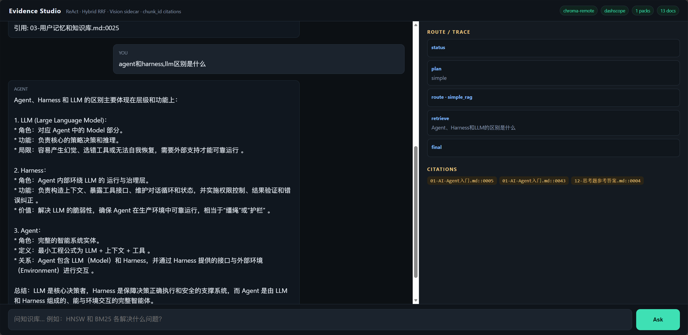
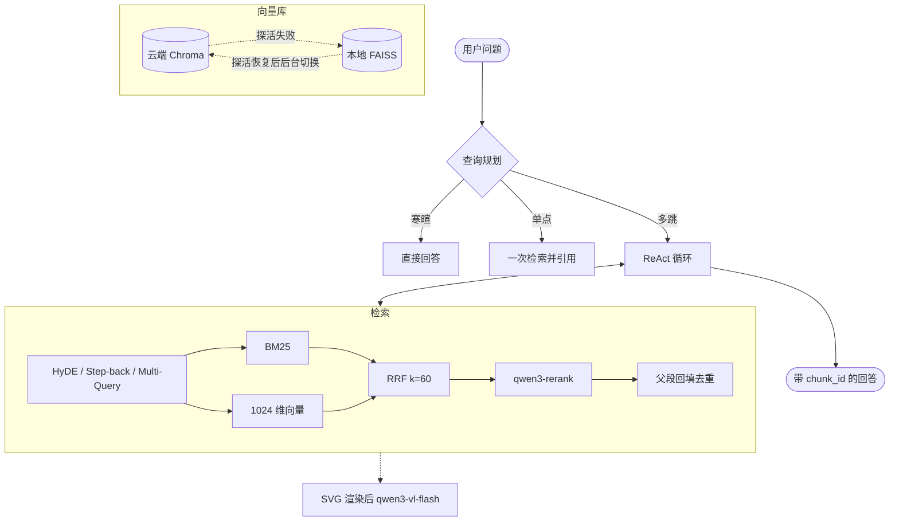

# Multi-Modal Agentic RAG

面向《AI Agent 入门》的多模态 Agentic RAG。一个通义千问 Key 驱动对话、视觉、精排和向量；默认使用本地 FAISS。

[](https://www.python.org/)
[](LICENSE)
[](eval/metrics_snapshot.json)
[](eval/metrics_snapshot.json)

## 快速开始

```bash
python -m venv .venv
# Windows: .venv\Scripts\activate
source .venv/bin/activate

pip install -r requirements.txt
playwright install chromium
cp .env.example .env
```

在 `.env` 填入 `DASHSCOPE_API_KEY`。推荐直接打开网页：

```bash
python main.py web
```

浏览器访问 http://127.0.0.1:7860 。左侧提问，右侧看路由、推理轨迹和引用。`web` 和 `chat` 会自己建索引，不必先跑 `ingest`。第一次会为全书做云端 embedding，之后只处理内容有变化的文件。



终端用法：

```bash
python main.py doctor
python main.py chat
python main.py ask 什么是 ReAct
```

## 能做什么

- **查询规划**：寒暄不检索；单点问题走一次检索；多跳问题进入 ReAct。改写支持 HyDE、Step-back、Multi-Query。
- **检索**：Markdown 父子分块（子块 1800 字检索，父段最多 3500 字回填并去重）。BM25 与 1024 维向量并行召回，RRF（k=60）融合后用 `qwen3-rerank` 精排。
- **引用**：回答必须标注检索结果里出现的 `[chunk_id=文件名::0001]`，没有依据则说明知识库中暂无。
- **视觉旁路**：问题与配图相关时，Playwright 将 SVG 渲成 PNG，交给 `qwen3-vl-flash` 生成结构说明。
- **长上下文**：约 70% 窗口时后台预摘要，约 90% 时同步压缩，保留最近 3 步。压缩期间新产生的步骤会合并回去。
- **界面**：推荐 `python main.py web`。Evidence Studio 左侧对话，右侧显示路由、推理轨迹和引用。

## 模型与存储

默认只需一个 Key：

| 用途 | 模型 |
| :--- | :--- |
| 对话 | `qwen3.6-flash` |
| 视觉 | `qwen3-vl-flash` |
| 精排 | `qwen3-rerank` |
| 向量 | `text-embedding-v3`，1024 维 |

向量也可以改本地：`EMBED_BACKEND=ollama`，模型 `bge-large-zh-v1.5`，需自行下载ollma并拉取该模型。换嵌入模型后需要重建索引。

向量库默认是本地 FAISS，界面和终端只显示当前库名。需要云端存储时，在 `.env` 设置：

```env
CHROMA_MODE=remote#faiss切换成remote
CHROMA_HOST=127.0.0.1#此处填入云端chroma_ip
CHROMA_PORT=8000
```

运行中每 5 秒探活。云端断开后重试 5 次，终端和网页显示 `RAG connection failed, retrying x/5`，仍失败则继续用本地 FAISS 回答。云端恢复后先在后台连接，当前问题结束后再切回云端 Chroma。

## 知识库

默认语料是 `data/ai-agent-book/`，摘自 [bojieli/ai-agent-book](https://github.com/bojieli/ai-agent-book)（Apache-2.0，署名见 `NOTICE`）。

额外的 Markdown 放进 `data/<目录名>/` 即可，启动或执行 `python main.py ingest` 时按文件哈希增量同步。约定见 [`data/README.md`](data/README.md)。

## 评测

100 道书内金标题，快照见 [`eval/metrics_snapshot.json`](eval/metrics_snapshot.json)。

| 阶段 | 指标 | 分数 |
| :--- | :--- | :--- |
| 检索重排 | Rerank Hit@5 | 98.00% |
| | MRR@5 | 0.9150 |
| LLM Judge | Faithfulness | 0.985 |
| | Context Precision | 0.991 |
| | Answer Relevancy | 0.950 |
| | Context Recall | 0.8625 |

## 命令

| 命令 | 作用 |
| :--- | :--- |
| `python main.py doctor` | 检查 Key、语料和 Playwright，不建索引 |
| `python main.py chat` | 终端对话 |
| `python main.py ask 问题` | 回答一次 |
| `python main.py web` | 推荐。Evidence Studio，默认 http://127.0.0.1:7860 |
| `python main.py ingest` | 只同步索引 |
| `pytest tests` | 单元测试 |

## 架构



## 目录

```
├── main.py                  # CLI、ReAct、索引与容灾
├── app.py / web/index.html  # Evidence Studio
├── docs/web-studio.png      # 网页使用截图
├── markdown_chunker.py      # 父子分块
├── hybrid_retriever.py      # BM25 + 向量 + RRF
├── query_plan.py            # 查询规划
├── index_sync.py            # 增量同步
├── vision_sidecar.py        # SVG 视觉旁路
├── data/ai-agent-book/      # 默认知识库
├── eval/metrics_snapshot.json
├── tests/
├── .env.example
├── LICENSE
└── NOTICE
```

## License

代码 MIT，见 [LICENSE](LICENSE)。书稿语料 Apache-2.0，见 [NOTICE](NOTICE)。
